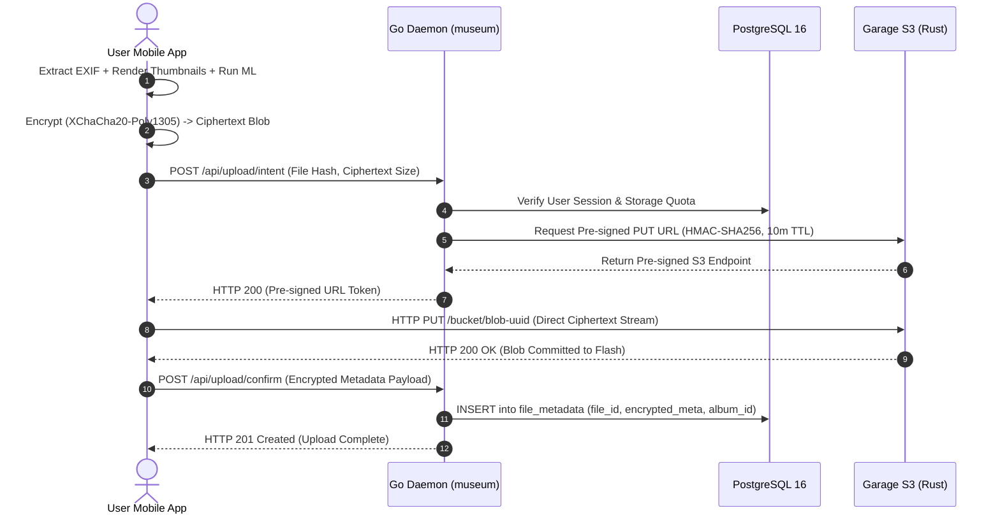

# Why the Server Never Decrypts: Building a Zero-Knowledge Personal Cloud on a $35 Single Board Computer

*By Prateek Chaudhary · Published August 26, 2026 · Week 00 Technical Essay*

---

## 1. The Illusion of the "Private Cloud"

If you ask the modern self-hosting community how to escape the gravitational pull of Google Photos or Apple iCloud, the answer is almost universally unanimous: buy a mini-PC, spin up Docker, and deploy a self-hosted photo management platform.

Over the past three years, the open-source community has delivered spectacular software in this category. Platforms like Immich and Photoprism look stunning. They offer fluid timeline scrolling, instantaneous face clustering, object search powered by local Machine Learning (ML) models, and automated mobile camera sync. For millions of users, running one of these stacks on an old Intel NUC sitting in a closet feels like the ultimate victory for data sovereignty.

It isn't. Or rather, it is only half a victory.

What most developers fail to confront until it is too late is the **fundamental trusted-server vulnerability**. Traditional self-hosted software merely relocates the corporate surveillance stack into your living room. The architecture remains identical: the mobile client acts as a dumb camera stream; the server acts as an omniscient brain that receives your raw, unencrypted photos, decrypts them in memory, scans every face, indexes GPS coordinates in a database, and stores the raw JPEG/HEIC files in plaintext on a local filesystem.

Now consider the physical threat model:
A burglar breaks into your apartment and grabs the mini-PC off your desk. Or a law enforcement agency seizes your hardware. Or an unpatched vulnerability in an unrelated Docker container on your local network grants an attacker root access to your machine. 

The moment an adversary achieves physical or root access to that server, your "private cloud" evaporates. Every family photograph, every private document, and every geolocation tag is immediately accessible in the clear. Full-disk encryption (like LUKS) protects data at rest when the machine is powered off, but home appliances run 24/7/365. While the machine is powered on and decrypting daily photo backups, the cryptographic keys reside unprotected in Linux RAM.

If a personal cloud appliance can be forensically dumped by anyone who physically unplugs it from your wall, you have not built a private vault. You have simply built an unmonitored target.

---

## 2. Inverting the Model: The Client-First Zero-Knowledge Paradigm

To solve this problem permanently, we are building **`sdrive`**—a dedicated, open-source home photo backup appliance running on an ultra-low-power Rockchip ARM board across a 12-week build log. 

The foundational design constraint of `sdrive` is uncompromising: **the server must never possess the mathematical capability to decrypt a photograph.**

```
Traditional Self-Hosted Model (Trusted Server):
[ Phone ] === (Plaintext Photo) ===> [ Server / Docker ] ---> (Face ML + Thumbnails) ---> [ Disk (Plaintext) ]
                                            │
                                    (Holds All Keys)

sdrive Model (Zero-Knowledge Ingestion):
[ Phone ] ---> (Local ML + Thumbnails) ---> (Argon2id + XChaCha20 Encrypt)
   │
   ├── (1. Request Token) ─────────> [ Go / museum ] ───> [ Postgres (Encrypted Metadata) ]
   │                                       │
   │                               (Returns Pre-Signed URL)
   │                                       │
   └── (2. Direct Ciphertext PUT) ──────────────────────> [ Rust / Garage S3 ] ───> [ Flash (Ciphertext Only) ]
```

In `sdrive`, the server is treated as an actively hostile, untrusted storage node. The architectural pipeline is inverted:

### 1. Key Derivation on the Handset
When a user sets up their device, a master cryptographic key is derived entirely on the mobile handset using **Argon2id**—the state-of-the-art memory-hard key derivation function. The user’s passphrase is never transmitted over the network, never logged, and never stored on the server.

### 2. Local Heavy Lifting
Before a single byte leaves the phone, the mobile client executes all computationally expensive tasks locally:
- Metadata extraction (EXIF timestamps, camera sensors, GPS coordinates).
- Compressed thumbnail preview generation.
- Machine-learning facial recognition and vector embedding generation, executed directly on the smartphone's dedicated hardware Neural Processing Engine (Apple Neural Engine on iOS or Android NNAPI).

### 3. Authenticated Encryption at the Edge
The raw photo, generated thumbnails, and metadata JSON payload are encrypted independently on the device using **XChaCha20-Poly1305**—an authenticated symmetric cipher utilizing a 192-bit nonce. Nonce reuse in traditional AES-GCM can catastrophically compromise the secret key; XChaCha20's massive 192-bit nonce space allows random nonce generation for every single file chunk with zero mathematical risk of collision over billions of photos.

By the time the mobile app opens a network socket, the photo is already an opaque, pseudorandom string of high-entropy ciphertext.

---

## 3. The Ingestion Loop: S3 Pre-signed URLs

The most common mistake when architecting a zero-knowledge backend is turning the application server into a file transfer proxy.

If the mobile client were to upload the encrypted payload through the application API server (e.g., streaming HTTP POST through a Go or Python daemon), the server runtime would be forced to buffer, allocate heap memory, and pipe millions of incoming megabytes to disk. Under concurrent multi-device backups, garbage collection pauses would spike, memory consumption would explode, and a low-power single-board computer would crash under Out-Of-Memory (OOM) conditions.

`sdrive` decouples the **control plane** from the **data plane** through out-of-band **S3 pre-signed URLs**:



1. **Intent Declaration:** The client contacts `museum` (the Go backend daemon) declaring: *"I have an encrypted blob of size 14.2MB to back up."*
2. **Pre-signed Authorization:** `museum` validates the user session in PostgreSQL and asks the object storage daemon to generate a temporary, HMAC-SHA256 authenticated PUT URL valid for exactly 10 minutes.
3. **Direct-to-Storage Ingestion:** `museum` returns the URL and terminates the connection. The mobile client streams the 14.2MB encrypted payload *directly* to the storage daemon via HTTP PUT.
4. **Metadata Commitment:** Once the storage daemon responds with `HTTP 200 OK`, the client makes a final lightweight call to `museum` to commit the encrypted metadata record into PostgreSQL.

Because the heavy data payload streams straight into the storage engine without passing through the Go runtime memory, `museum` can manage thousands of concurrent requests while consuming less than 40MB of RAM.

---

## 4. Hardware Sizing: Why an RK3566 Beats an 8-Core AI Beast

Once you enforce client-side encryption and out-of-band storage ingestion, the hardware requirements for the host appliance change radically.

The single-board computer market is currently obsessed with next-generation SoCs like the Rockchip RK3588 and RK3576, featuring 6 TOPS NPUs, 8-core Big.LITTLE CPU topologies, and high-frequency DDR5 memory. If you are running Immich with server-side facial recognition and video transcoding, you genuinely need that computational horsepower.

But when the server is mathematically blind, high-end silicon is completely wasted:
- The server does **zero** neural network inference (the phone did it).
- The server does **zero** image resizing or thumbnailing (the phone did it).
- The server does **zero** video transcoding (the phone did it).

The server has exactly two jobs: execute lightweight SQL transactions in PostgreSQL, and stream incoming encrypted bytes from a network socket onto flash memory.

```
Hardware Comparison: Overkill vs. Right-Sized

Metric                 RK3588 Board (Overkill)       Radxa ROCK 3C (RK3566)
----------------------------------------------------------------------------
Board Cost             $120 - $160                   $35 - $45
Idle Power Draw        5.0W - 8.0W                   1.8W - 2.5W
Thermal Dissipation    Requires Active Fan           Silent Passive Aluminum
NPU Utilization        0.0% (Zero ML on server)      No NPU wasted
RAM Required           8GB - 16GB                    4GB LPDDR4 (Overkill)
Throughput Bottleneck  Gigabit Ethernet (125MB/s)    Gigabit Ethernet (125MB/s)
```

The **Radxa ROCK 3C** (powered by a quad-core ARM Cortex-A55 RK3566 clocked at 1.8GHz with 4GB LPDDR4) is not a compromise—it is the engineered sweet spot. It runs completely silent under a passive aluminum heatsink, draws less than 2.5 watts at idle (less than ₹40 / $0.50 of electricity per month), and its onboard Realtek Gigabit Ethernet transceiver easily saturates a 1Gbps home network connection when saving encrypted files.

---

## 5. Storage Engine Architecture: Why Garage Won and MinIO Failed

When setting up self-hosted S3 object storage, the industry default is MinIO. On Day 02 of this project, MinIO was listed in our architectural diagrams. By Day 05, it was formally excised from the repository in **ADR 0004**.

Why did MinIO fail the edge appliance test?

MinIO is an extraordinary enterprise product, but it is built for hyperscale datacenter architectures. It assumes high-speed multi-node NVMe clusters, gigabytes of spare memory, and uniform enterprise drives. When deployed on a single-board computer with constrained RAM and consumer-grade flash memory, MinIO introduces severe operational friction:
- **High Memory Footprint:** MinIO's Go runtime and caching buffers aggressively claim hundreds of megabytes of memory.
- **Strict I/O Sensitivity:** MinIO enforces rigorous disk format checks that frequently log warnings or lock up when executing high-concurrency writes to slow flash storage or microSD cards.
- **Enterprise Licensing:** MinIO’s license evolution and deprecation of single-binary edge features make it hostile to embedded open-source appliances.

Enter **Garage**—an open-source, lightweight S3-compatible distributed object store written in Rust by the Deuxfleurs collective.

```
Storage Daemon Memory Footprint Comparison:

MinIO (Go Runtime):      [████████████████████████████████] ~350MB - 600MB
Garage (Rust / Tokio):   [████] ~45MB - 60MB
```

Garage was architected from line one to run on heterogeneous, low-power edge nodes (the literal "potato computer" use case). It compiles to a single, dependency-free static binary, maintains an idle memory footprint of under 50MB, and utilizes Tokio-based asynchronous I/O to handle slow storage media gracefully without panicking or leaking file descriptors under load. 

By pairing Garage with Ente's pre-signed URL workflow, we achieve enterprise-grade S3 storage durability inside a memory budget that leaves 85% of our system RAM available for the Linux page cache.

---

## 6. Networking: Punching Through Carrier-Grade NAT

A cloud photo backup is useless if it only functions when your phone is connected to your living room Wi-Fi. The appliance must backup seamlessly whether you are connected to cellular 5G in another city or a hotel Wi-Fi across the world.

However, modern internet service providers (ISPs) almost universally deploy **Carrier-Grade NAT (CGNAT)**. Your home router does not have a unique, public IPv4 address; it sits behind a massive ISP-level NAT pool. Traditional port forwarding on your router is mathematically impossible, and even if it were possible, exposing raw database or storage ports to the public internet invites automated vulnerability scanning within minutes.

```
The Network Topology:
[ Mobile Phone (5G / Remote) ]
           │
     (Tailscale Mesh / WireGuard P2P Tunnel)
           │
[ Carrier-Grade NAT (CGNAT) Firewall ]
           │ (STUN / DERP NAT Traversal)
[ Home Router (No Ports Forwarded) ]
           │
[ Radxa ROCK 3C (100.x.y.z Encrypted Overlay) ]
```

We solve this using a peer-to-peer **WireGuard mesh overlay** via **Tailscale**:
1. The Radxa board and the mobile handset are both authenticated nodes on a private WireGuard overlay network (allocating stable CGNAT-safe `100.x.y.z` IPv4 addresses).
2. Tailscale handles NAT traversal automatically using Interactive Connectivity Establishment (ICE) and STUN protocols, establishing direct peer-to-peer UDP encrypted tunnels between the phone and the board whenever possible.
3. Zero ports are forwarded on the home router. The board remains completely invisible to public internet port scanners.
4. While we use Tailscale’s managed coordination plane for the initial development velocity in Weeks 0–5, our architecture treats the VPN as a swappable component with a planned migration to self-hosted **Headscale** in Week 06 and Week 12.

---

## 7. What I Know Today That I Didn't Know a Week Ago

Looking back across Week 00, the gap between "having an idea" and "engineering a system" is staggering. 

Seven days ago, I assumed:
- That building a personal cloud required buying an expensive mini-PC with an NPU.
- That the backend API server would act as a middleman proxying photo uploads to disk.
- That MinIO was the only viable self-hosted S3 implementation.
- That standard laptop USB-C power supplies would cleanly power any single-board computer.

Today, every single one of those assumptions has been dismantled, tested, and replaced with concrete engineering specifications:
- Zero-knowledge encryption eliminates the need for expensive server silicon.
- Out-of-band pre-signed URLs keep server memory allocation flat and decouple the data plane from the control plane.
- Garage delivers rock-solid S3 storage in Rust with a 50MB RAM footprint.
- Regulated 5V/3A linear switching supplies protect single-board computers from transient voltage brownouts.

The repository scaffolding is committed. The GNU AGPL-3.0 license is bound. The secret scanners are active. The Ed25519 cryptographic keys are generated. And the Radxa ROCK 3C is sitting on the desk with its passive heatsink mounted.

Next week, we plug it into the wall.

---

*This article is part of the **`sdrive` Build Log**—a 12-week public engineering series documenting the ground-up development of an end-to-end encrypted home photo backup appliance. Track the daily code commits and logs on GitHub: [github.com/PrUcky/sdrive-build-log](https://github.com/PrUcky/sdrive-build-log).*
